### بسم الله الرحمن الرحيم
(**web application ctf**)النهاردة هنبدأ في شرح تحديات الويب 

===*===*===*===*===*===*===*===*===*===*==*===*===*===*===*===*===*===*

### طب ايه هي المتطلبات  للبدء في حل النوع ده ؟؟

1.  (Web app programming language) مطلوب منك معرفة كويسة بلغات البرمجة الخاصة بكتابة مواقع الويب 
 
#### طب زي ايه اللغات دي ؟؟

1. Front end >>  HTML , Javascript
2. Back end  >>  php , sql 

**w3school**  من المواقع الكويسة عشان تذاكراللغات دي موقع

- https://www.w3schools.com/html/default.asp
- https://www.w3schools.com/js/default.asp
- https://www.w3schools.com/sql/default.asp
- https://www.w3schools.com/php/default.asp

طبعا من احسن الطرق انك تتأكد انك اتقنت اللغات دي كويس هي انك تعمل موقع بسيط تتعلم فيه وهتعرف تتعامل مع الثغرات 

`------------------------------------------------------Learn By Doing-------------------------------------------------------`

===*===*===*===*===*===*===*===*===*===*==*===*===*===*===*===*===*===*

#### طب ايه الادوات اللي هستخدمها في الحل ؟؟

1- (**Burp Suite**) 
بس CTF من اهم الادوات اللي هتستخدمها في الويب عاما مش  
 منها freeدي النسخة ال 
-   https://portswigger.net/burp/communitydownload
 
بتبقي نازبة مع النسخة  kali linuxولو محمل ال 

Browser للي جاي من Requestال capture عشان تعرف تfoxyproxyاسمه extension وعشان تشغلها محتاج 
- Burpودي اعدادات ال 
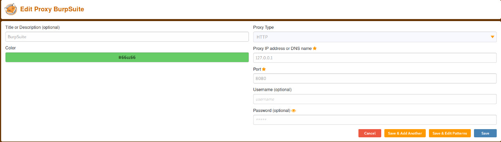

2- (Brute Force on Directories) وفي ادوات هتحتاجها كتير في انك تعمل 

    - `**gobuster**`
     ---*---*---*
طريقة تنزيلها لو مش مو جودة عندك 
- `sudo apt-get install gobuster`
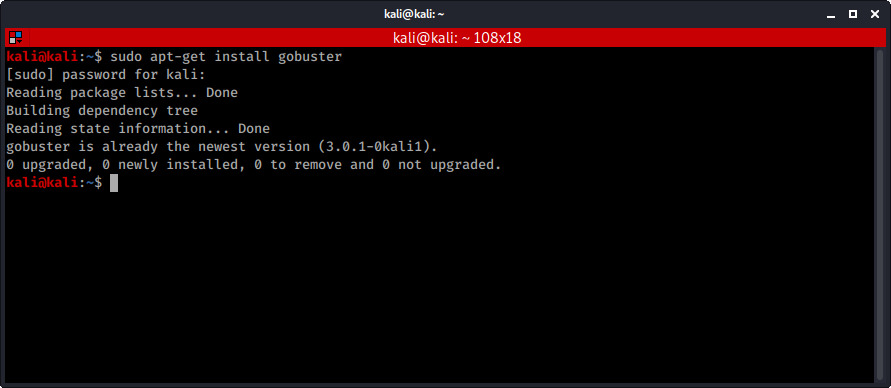

(Brute Force on Directories)ودي الطريقة لو عايز تعمل 
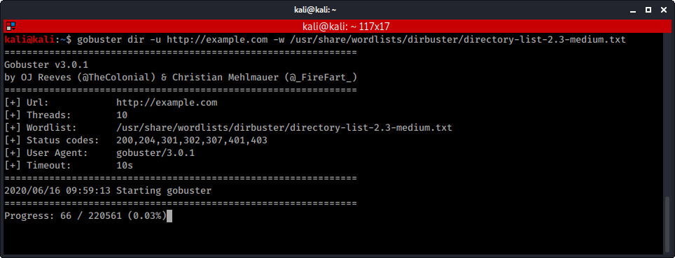

وبص بصة علي الموقع ده 

`https://redteamtutorials.com/2018/11/19/gobuster-cheatsheet`
   
    - `**wfuzz**`
     ---*---*---*
طريقة تنزيلها لو مش عندك 

- `sudo apt-get install wfuzz`

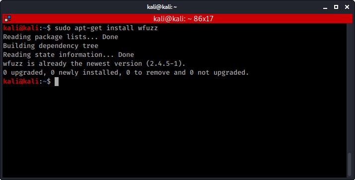

- (Directories , files , parameters) علي ال brute force بتعمل Wfuzz بالظبط بس gobusterدي زي ال 
    
`FUZZ` عليها كلمة brute force وبتحط مكان الحاجة اللي عايز تعمل 

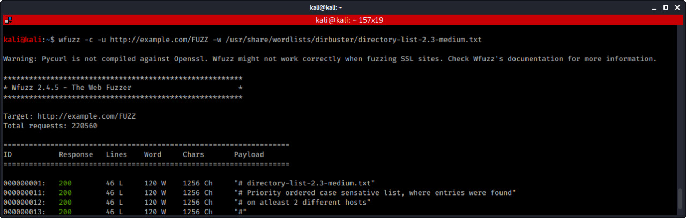

- (: وبص بصة علي الموقع ده

https://wfuzz.readthedocs.io/en/latest/user/basicusage.html

===*===*===*===*===*===*===*===*===*===*==*===*===*===*===*===*===*===*

 !! او ازاي ابدأ الحل في التحدي Initial analysis نيجي بقي لل

- للتحدي اللي معاك Automated Scan دي تقدر تقول عليها Crawling في حاجة اسمها ال
- وده بيبقي نازل مع نسخة الكاليOWASP ZAP بتتعمل في برنامج
- ولكن النسخة البرو منها Burp Suite وموجود في ال

1. ساعات بتلاقي حاجات تفيدك جوة  ( robots.txt/ )  اول حاجة بتعملها بتبص علي 

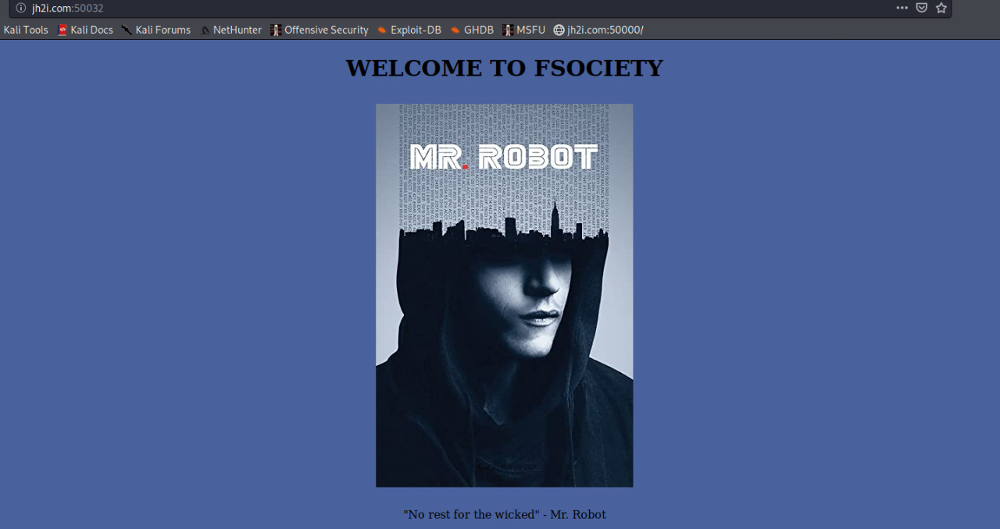
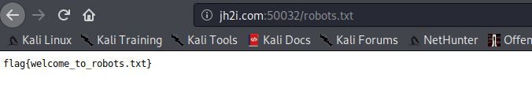

- :) اهو flag ولقينا ال
-----------------
2.  وركز علي الكومنتات المكتوبة عشان بتلاقي فيها حاجات مهمة source code بتبص علي ال

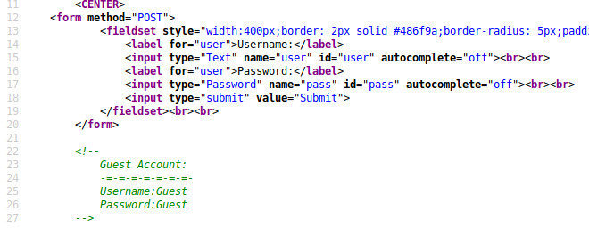

لقينا باسورد هينفهنا في التحدي

--------------------------------------------

3.  او اي توول بتستخدمها gobuster or dirb ب Directories علي ال Brute Force  بتعمل 
4.  ساعات بتكون فيها حاجات مهمة cookies بتشوف ال 

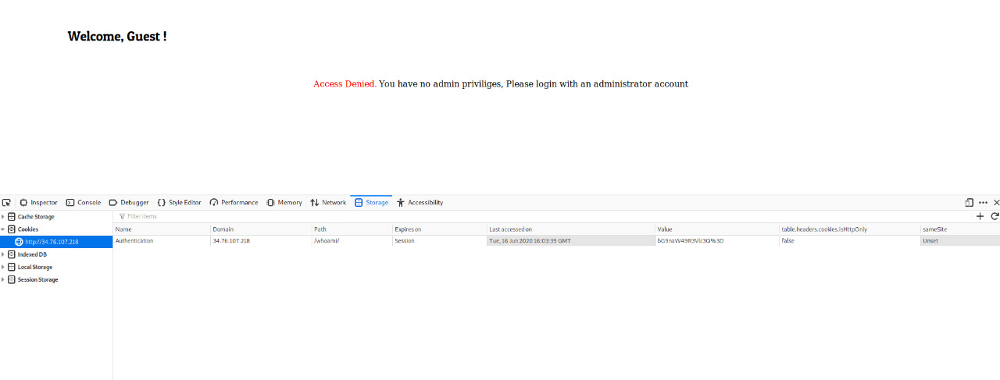
base64لقينا كود
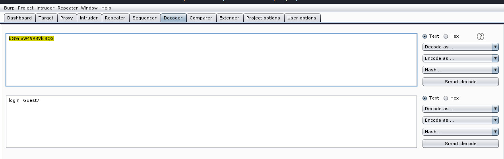
:) flag هنشوف ال admin لو خليناها Guestطلع

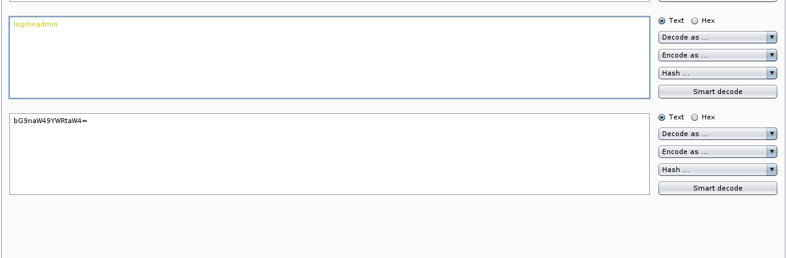

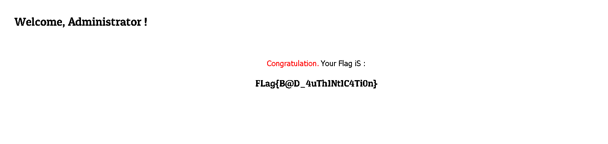

**Cookies is The Solution**

5. فيه ايه وعشان لو فيه حاجة نعدلها Request عشان نشوف Burp في ال intercept on  بنعمل      
 Browser نفسهامن غير الرجوع لل  Burp في ال Response دي بنشوف ال tap في ال Send to Repeter وممكن نعمل 
   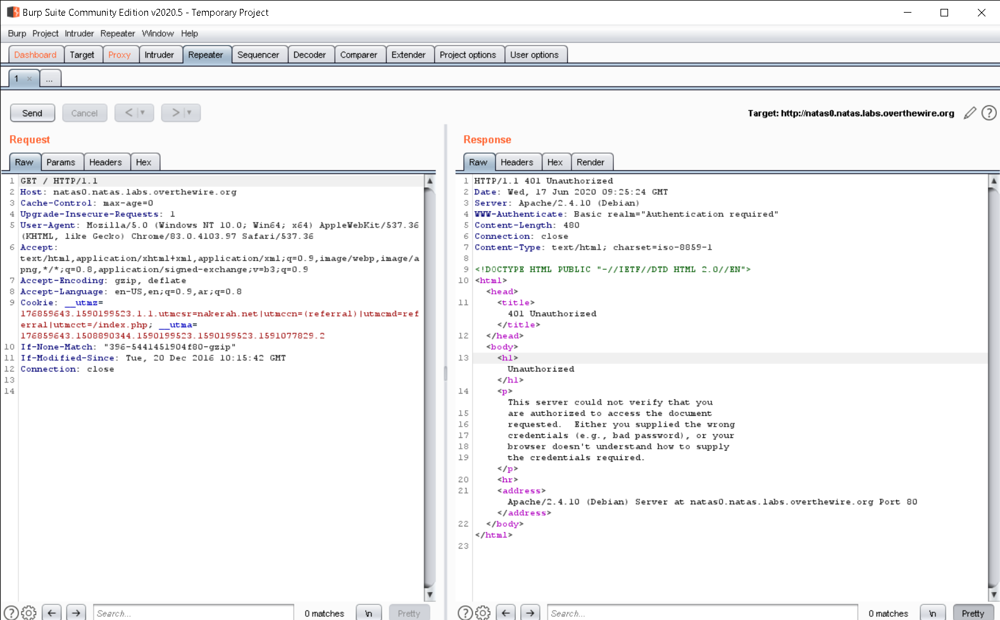

===*===*===*===*===*===*===*===*===*===*==*===*===*===*===*===*===*===*

Platforms نروح بقي لأشهر الثغرات او الاكثر شيوعا في تحديات الويب في معظم المسابقات وال

وهنقسمها لنوعين وهما :-

- **Server Side** 
- **Client Side** 

> "**Server Side**"نبدأ بأول نوع وهو

1. `**Authentication Bypass**`
  >
cookies عن طريق انك تغير في ال admin وتخلي نفسك user او guest وهي انك تكون داخل ك     
Request الموجودين في ال user-agent او تغير في اسم ال 
   
   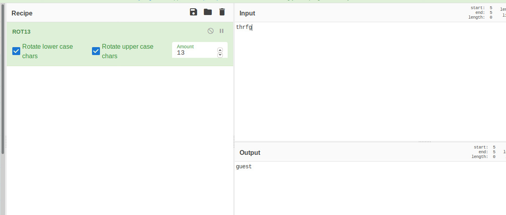
guest هنا انت داخل ك 
      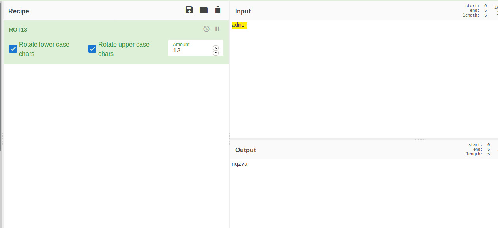

   adminلما عدلناها وخليناها 
   
   **flag ظهر ال**
      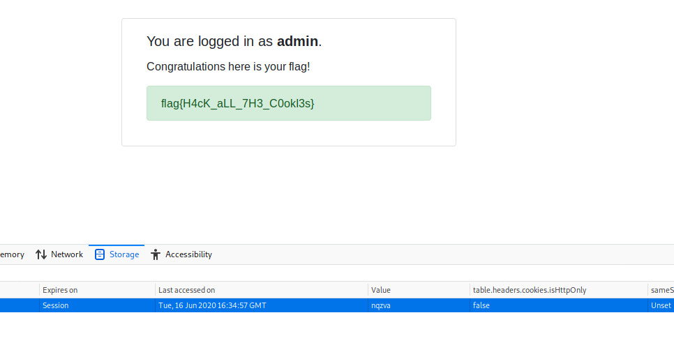

   
   
2. `**LFI & Directory traversal**`
  
- flag الخاصة بالموقع وبالتالي ممكن تلاقي Directories وهي انك تقدر تتنقل في ال
-  flag  او باسورد الادمن اللي هيوصلك لل 
    

3. `**File upload**` 

command وغيره وفي الحالة دي ممكن تحط جوة الملف ده حاجة زي plugins وفي الثغرة دي بيبقي متاح للمستخدم انه يرفع ملفات زي الصور وال 
   

4. `**SQl injection(SQLI)**`

- دي من اهم واشهر الثغرات الموجودة في تحديات الويب 
- sqli عشان نفهم sql طب نبدأ بأول حاجة وهي ايه هو 
- (Structured Query Language) هو اختصار ل sql ال
- databases هي نوع من انواع ال sql وال
- او البحث او التغير وغيرها من العمليات  database بيستخدم في تحديث sql وال 
  
- اللي بتخليك injection attacks وهو نوع من ال SQLI نروح بقي لل
- دي statements وال execute malicious sql statement ت
- bypass application security measuresوممكن من خلال ده ت web application الخاصة بال database بتتحكم في ال
- flag الخاصة بالموقع فبالتالي ممكن تجيب ال database وبما انك قدرت تتحكم في ال

- (: وبص بصة علي اللينكات دي
- https://www.cloudflare.com/learning/security/threats/sql-injection
- https://www.acunetix.com/websitesecurity/sql-injection

5- `**JWT attacks (JSON Web Token)**`

*JavaScript Object Notation* هو اختصار ل JSONالJSON نبدأ ب ايه هو ال 
       
(Human-Readable) ك نص قابل للقراءة *Transimated data* ال هو بيخزن JSON باختصار كدا
      
- (: وبص بصة علي اللينكات دي  لو عايز تفهم اكتر
- https://www.w3schools.com/whatis/whatis_json.asp
- https://www.json.org/json-en.html

 بقي ؟ **JWT** طب ايه هو
---*---*---*---*---*---*
- web application الخاص JSON لل token ده ... يعني السيرفير بيعمل token بcertify فيه ال user identity
- request للسيرفر في كل token بيبعت Client و ال Client وبعد كدا بيبعته لل
- عشان يعرف السيرفر ان ده المستخدم كذا

- decrypt وعشان تعملها encrypted بيبقي معمولها JWT وغالبا ال
- بتستخدم الموقع ده
https://jwt.io/#debugger-io

بيتكون من 3 عناصر وهما *JWT* وال
- Header
- Payload
- Signature 

EX :
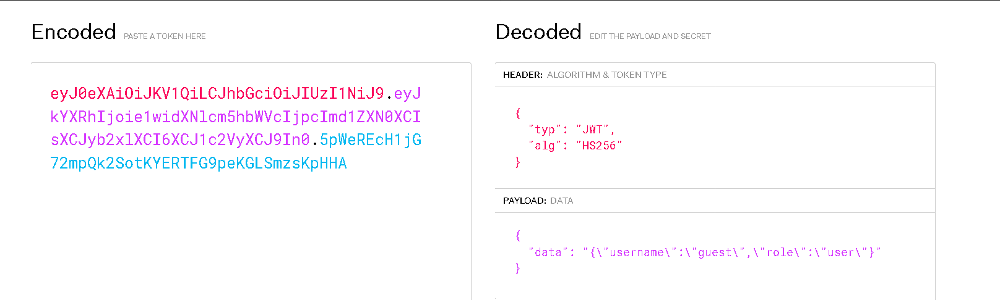
- flagفبالتالي مش هتقدر تشوف ال userموجودة role هنا ال
- هنعدل عليها كالأتي
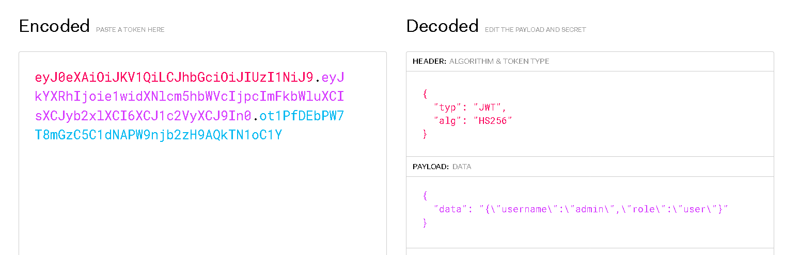
- للصفحة refresh ونحطها مكان اللي فاتت ونعمل 
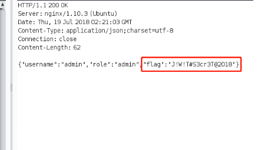

- :) flag هيظهرلك ال

- (: وبص بصة علي اللينكات دي

- https://jwt.io/introduction
- https://flaviocopes.com/jwt
  
===*===*===*===*===*===*===*===*===*===*==*===*===*===*===*===*===*===*

> Client Side نيجي بقي للنوع التاني من الثغرات وهو ال

XSS (Cross Side Scripting) وده فيه ثغرة مهمة جدا وهي ال

- output الخاص بالتحدي  بيطلعه input بيباخد اللي بتدخله ك web application دي غالبا بتبقي موجودة لو ال 
- بتحطها payloads عن طريق command اي run وبالتالي ممكن ت
- عشان تشوف السطر اللي بيطبع اللي بتدخله source code وطبعا محتاج عشان تشغل الثغرة دي وتبص علي ال
  ### وتقفل السطر ده
- يشتغل payload عشان ال `</h2>` يبقي يتقفل ب `<h1>` يعني لو بادئ ب
     
بينقسم لثلاث اقسام وهم xss وطبعا ال

 - Stored XSS
 - Reflected XSS
 - DOM XSS 
- :)وفي الفيديو في حل تحدي عن الثغرة دي
بالتفصيل xss وكورس الباشمهندس ابراهيم حجازي شارح ال
  
https://www.youtube.com/watch?v=xiw_O5shcK4&list=PLv7cogHXoVhXvHPzIl1dWtBiYUAL8baHj&index=29
https://www.youtube.com/watch?v=qp264U2QyY8&list=PLv7cogHXoVhXvHPzIl1dWtBiYUAL8baHj&index=30

جميلة جدا وهتفهمك ازاي تتعامل مع الثغرة **Google XSS Game** وفي
  
- https://xss-game.appspot.com
